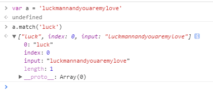
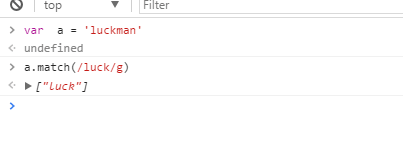

# js的字符常用函数总结
dou'dou'zhuan
> 之前一直想写一个js数组的常用函数的总结，可惜之前一直没有合适的平台来写，后来发现一开始使用的github才是最好的平台。

### match 函数

#### 基本介绍 
    只有一个参数，一般是字符串或者是正则， 正则的分两种情况

    1.第一种
        没有g标志的正则。只匹配第一个成功的，返回一个数组，并且数组里有index属性，记录匹配成功的起始字符串的位置。还有个input属性引用这字符 

   

     2.第二种
     是有g标志的，在全局搜索，返回一个数组，但是数组里没有了index属性和input属性

    
 