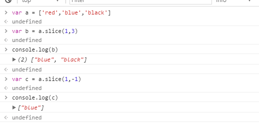
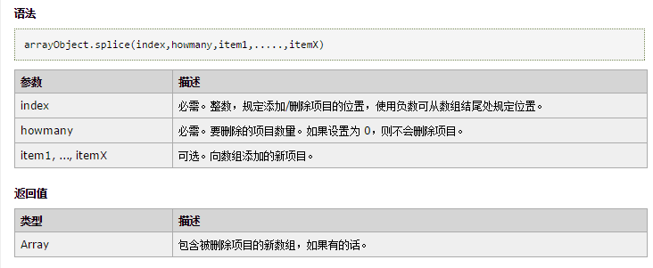

# js 数组常用的函数总结

> 这些函数，我经常告诫自己这些函数很重要，要牢记使用的函数。可是过了一段时间后还是很容易遗忘的了，遗忘后，当遇到要使用的时候，还是要百度，看看别人的怎么使用的，所以写了一篇总结。方便查找

### slice
  #### 基本介绍
    
第一个参数是设置开始截取的位置。第二参数可以忽略不设置。是截取结束的位置。两个都可以是负值。

### splice 
  #### 基本介绍

  第一个参数确认删除的位置的起始位置。第二参数始删除的数量,为0时是添加，第三个参数是添加的item

  
        