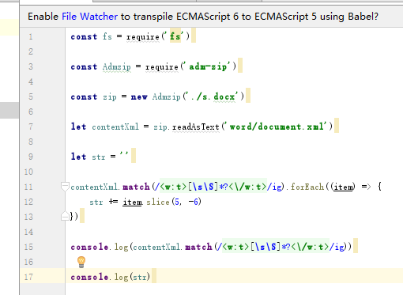
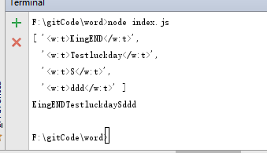

# 有关js读取word文档的初步尝试

> 今天git服务器坏了，可惜没能知道是啥错，和解决的方案。有点小遗憾。

今日的任务接到的任务是研究js读取word文档的方案，这次是直接给需求，不过使用vue在前端直接解析，觉得不怎么好，毕竟这方面一般都是后端人员解决的，然后返回给前端。

### 原理

word文档本质也是个压缩包，我们可以在修改其后缀名为.zip后解压查看。
可以看到在word文件夹下，有个document.xml文件，可以通过node的文件函数来读取其中的内容，然后使用字符串的函数，match来转化成为数组。然后通过数组的方法读取内容

### 使用工具

    node npm 以及 adm-zip

其中adm-zip 包是把word文档的docx文件转化成xml的对象。

代码如下： 

 

 运行效果图： 

 